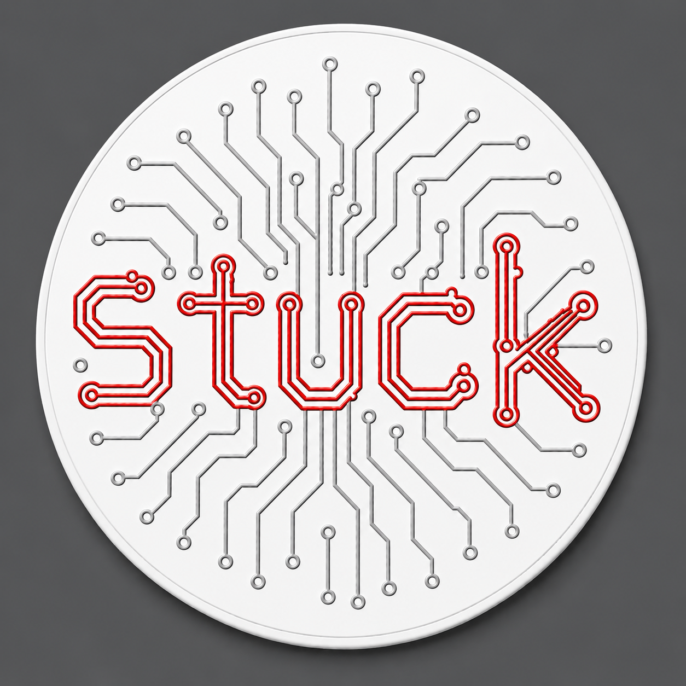

# Stuck

  

**Stuck** is a Home Assistant custom integration for binding NFC tags to physical objects and tracking recurring time-based reminders.

Stick a tag on something, scan it, and track when it was last reset, when it is due again, and how long it has been sitting.

## What it is

Stuck is meant for real physical things like:

- litter boxes
- HVAC filters
- water filters
- appliance maintenance points
- bins, tools, or supplies that need periodic attention

This is not really a chore app.
It is closer to **object-based recurring reminders**.

## Current project status

This project is in active development.

Right now the repo contains:

- the custom integration scaffold
- config flow and options flow
- storage-backed tracked objects and pending tags
- basic sensors, binary sensors, and reset buttons
- a first dashboard concept
- planning docs for product, architecture, and implementation

## Docs

- [`docs/stuck-v1-spec.md`](./docs/stuck-v1-spec.md)
- [`docs/stuck-technical-architecture.md`](./docs/stuck-technical-architecture.md)
- [`docs/stuck-implementation-checklist.md`](./docs/stuck-implementation-checklist.md)

## Repo assets

- [`assets/stuck-logo.png`](./assets/stuck-logo.png)

## Next steps

Near term:

1. improve tag-scan UX
2. make service ergonomics friendlier
3. improve dashboard generation / object presentation
4. harden runtime behavior and test flows
5. improve install and end-user docs

Later, we should absolutely make this README more marketing-friendly and installation-friendly for other users.
